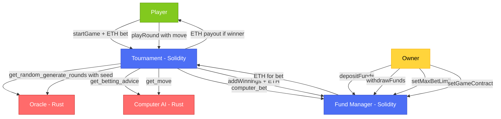

# Cross-VM Rock-Paper-Scissors Tournament

A demonstration of **Fluent's blended execution**, showcasing seamless interoperability between Rust and Solidity smart contracts on a single blockchain - no bridges, no oracles, just direct atomic interactions.

[](https://rakshithvk19.github.io/Cross-VM-Rock-Paper-Scissors/)
[](https://fluent.xyz)
[](https://soliditylang.org)
[](https://rust-lang.org)
[](https://reactjs.org)
[](LICENSE)

## 🌟 Overview

This project demonstrates Fluent's blended execution environment through a fully functional Rock-Paper-Scissors tournament with real ETH betting. Experience how Rust and Solidity contracts seamlessly interact within the same transaction, leveraging each language's strengths in a single unified application.

### 🎯 Key Features

- **🔄 Cross-VM Execution**: Rust and Solidity contracts working together atomically
- **💰 Real ETH Betting**: Place bets and win ETH in tournament-style gameplay
- **🤖 Intelligent AI**: Rust-powered computer opponent with strategic betting
- **🎲 Deterministic Randomness**: Fair, verifiable random number generation
- **💼 Fund Management**: Automated treasury system for computer's betting pool

## 🏗️ Architecture

### Smart Contract System



### Architecture Flow

**Game Initialization:**

1. 🎮 **Player** calls `startGame()` with ETH bet → 🏆 **Tournament**
2. 🏆 **Tournament** requests random seed via `get_random_seed()` → 🎲 **Oracle** (Rust)
3. 🏆 **Tournament** determines rounds via `generate_rounds(seed)` → 🎲 **Oracle** (Rust)
4. 🏆 **Tournament** gets betting advice via `get_betting_advice()` → 🤖 **Computer AI** (Rust)
5. 🏆 **Tournament** places computer bet via `computer_bet(amount)` → 💰 **Fund Manager**
6. 💰 **Fund Manager** sends ETH to Tournament for computer's bet

**Game Play:**

1. 🎮 **Player** calls `playRound(move)` → 🏆 **Tournament**
2. 🏆 **Tournament** gets computer move via `get_move()` → 🤖 **Computer AI** (Rust)
3. Round winner determined, state updated

**Game Completion:**

1. 🏆 **Tournament** distributes winnings:
   - If Player wins: ETH payout → 🎮 **Player**
   - If Computer wins: `addWinnings()` + ETH → 💰 **Fund Manager**
   - If Draw: Each gets their original bet back

**Administration:**

- 🔑 **Owner** manages Fund Manager: deposits/withdraws funds, sets bet limits, links game contract

### Component Breakdown

| Component        | Language         | Purpose                    | Key Features                                           |
| ---------------- | ---------------- | -------------------------- | ------------------------------------------------------ |
| **Oracle**       | Rust             | Random number generation   | Deterministic randomness, Tournament length selection  |
| **Computer AI**  | Rust             | Strategic decision making  | Pattern recognition, Adaptive betting, Move selection  |
| **Fund Manager** | Solidity         | Computer's fund management | ETH custody, Betting limits, Owner controls            |
| **Tournament**   | Solidity         | Core game logic            | Game state, Payout distribution, Event emissions       |
| **Frontend**     | React/TypeScript | User interface             | Web3 integration, Real-time updates, Responsive design |

### Why This Architecture?

- **Rust Components**: Leverage Rust's performance for complex algorithms and mathematical operations
- **Solidity Components**: Utilize Solidity's mature DeFi patterns for financial operations
- **Atomic Interactions**: All cross-language calls happen within single transactions
- **No External Dependencies**: Direct contract-to-contract communication without bridges

## 🚀 Quick Start

### Prerequisites

- **Node.js** (v18+) and npm
- **Rust** (1.70+) with `wasm32-unknown-unknown` target
- **Foundry** for Solidity compilation
- **gblend** CLI for Fluent deployment
- **MetaMask** wallet with Fluent Devnet ETH

### Installation

1. **Clone the repository**

   ```bash
   git clone https://github.com/[your-username]/Cross-VM-Rock-Paper-Scissors.git
   cd Cross-VM-Rock-Paper-Scissors
   ```

2. **Install deployment tools**

   ```bash
   make install
   # Run 'foundryup' in a new terminal after installation
   # Restart terminal before continuing
   ```

3. **Set up environment**

   ```bash
   cp .env.example .env
   # Edit .env with your private key and configuration
   ```

4. **Install frontend dependencies**
   ```bash
   cd frontend
   npm install
   cd ..
   ```

## 📦 Deployment Guide

### Step-by-Step Contract Deployment

1. **Deploy Rust Oracle**

   ```bash
   make deploy-oracle
   # Copy the deployed address to .env as ORACLE_ADDRESS
   ```

2. **Deploy Rust Computer AI**

   ```bash
   make deploy-computer-ai
   # Copy the deployed address to .env as COMPUTER_AI_ADDRESS
   ```

3. **Deploy Solidity Fund Manager**

   ```bash
   make deploy-fund-manager
   # Copy the deployed address to .env as FUND_MANAGER_ADDRESS
   # Note: Automatically funds with 0.02 ETH
   ```

4. **Deploy Solidity Tournament**

   ```bash
   make deploy-tournament
   # Copy the deployed address to .env as TOURNAMENT_ADDRESS
   ```

5. **Configure Game System**

   ```bash
   make game-setup
   # Links Tournament contract with Fund Manager
   ```

6. **Generate ABIs for Frontend**

   ```bash
   make generate-abis
   # Creates TypeScript ABI files
   ```

7. **Update Frontend Configuration**
   ```bash
   cd frontend
   # Copy your contract addresses to .env
   cp ../.env .env
   ```

## 🎮 How to Play

### Local Development

```bash
make start-frontend
# Opens at http://localhost:3000
```

### Live Demo

Visit the deployed version: [Play Now](https://rakshithvk19.github.io/Cross-VM-Rock-Paper-Scissors/)

### Gameplay Instructions

1. **Connect Wallet**: Connect MetaMask to Fluent Devnet
2. **Get Test ETH**: Visit [Fluent Faucet](https://devnet.fluent.xyz/) for test ETH
3. **Place Your Bet**: Choose bet amount (0.001 - 0.1 ETH)
4. **Start Game**: Computer matches your bet automatically
5. **Play Rounds**: Select Rock, Paper, or Scissors
6. **Win the Pot**: Player with most round wins takes all!

### Game Rules

- Tournament length: 1-10 rounds (randomly determined)
- Each round: Rock beats Scissors, Scissors beats Paper, Paper beats Rock
- Winner takes entire pot (player bet + computer bet)
- Draws return original bets to both parties

## 📊 Deployed Contracts (Fluent Devnet)

| Contract                | Address                                      | Explorer                                                                                     |
| ----------------------- | -------------------------------------------- | -------------------------------------------------------------------------------------------- |
| Oracle (Rust)           | `0x3b4b6a6524c41f0e2eb1c96e05e8b7bd1f0b60f7` | [View](https://blockscout.dev.gblend.xyz/address/0x3b4b6a6524c41f0e2eb1c96e05e8b7bd1f0b60f7) |
| Computer AI (Rust)      | `0x93699576392ec65bb3577693a435a1b5dfee5c93` | [View](https://blockscout.dev.gblend.xyz/address/0x93699576392ec65bb3577693a435a1b5dfee5c93) |
| Fund Manager (Solidity) | `0xFc811dAF6F0C4ae0ca152B39A516843B43837C85` | [View](https://blockscout.dev.gblend.xyz/address/0xFc811dAF6F0C4ae0ca152B39A516843B43837C85) |
| Tournament (Solidity)   | `0x7Ee02De991198b55C138a64fe4355dc4315aB9C8` | [View](https://blockscout.dev.gblend.xyz/address/0x7Ee02De991198b55C138a64fe4355dc4315aB9C8) |

## 🛠️ Technical Implementation

### Cross-VM Magic ✨

```solidity
// Solidity calling Rust - It just works!
uint256 rounds = oracle.generate_rounds(seed);
Move computerMove = Move(computerAI.get_move(round, seed, history));
```

### Event-Driven Architecture

- **Real-time Updates**: All state changes emit events
- **History Tracking**: RoundPlayed events build game history
- **Balance Monitoring**: Automatic refresh on fund changes
- **Error Handling**: User-friendly error messages for all failures

### Security Features

- **Access Controls**: Owner-only functions for fund management
- **Betting Limits**: Configurable max bet amounts
- **Safe Transfers**: Robust ETH transfer handling
- **Input Validation**: Comprehensive parameter checking

## 🔧 Development

### Project Structure

```
Cross-VM-Rock-Paper-Scissors/
├── contracts/           # Solidity smart contracts
│   ├── RPSTournament.sol
│   ├── FundManager.sol
│   └── interfaces/
├── rust-oracle/         # Rust random number oracle
├── rust-computer-ai/    # Rust AI opponent
├── frontend/           # React TypeScript app
│   ├── src/
│   │   ├── components/
│   │   ├── hooks/
│   │   └── contracts/
│   └── package.json
├── Makefile           # Deployment automation
└── .env.example       # Environment template
```

### Available Commands

| Command                    | Description                       |
| -------------------------- | --------------------------------- |
| `make install`             | Install gblend and foundry        |
| `make deploy-oracle`       | Deploy Rust Oracle contract       |
| `make deploy-computer-ai`  | Deploy Rust Computer AI           |
| `make deploy-fund-manager` | Deploy Fund Manager with 0.02 ETH |
| `make deploy-tournament`   | Deploy Tournament contract        |
| `make game-setup`          | Link Tournament with Fund Manager |
| `make generate-abis`       | Generate TypeScript ABIs          |
| `make start-frontend`      | Start development server          |

### Testing

```bash
# Run Solidity tests
forge test

# Run Rust tests
cd rust-oracle && cargo test
cd rust-computer-ai && cargo test

# Frontend tests
cd frontend && npm test
```

## 🌐 Network Information

### Fluent Devnet

- **Chain ID**: 20993
- **Explorer**: https://blockscout.dev.gblend.xyz/
- **Faucet**: https://devnet.fluent.xyz/

## 📚 Resources

- [Fluent Documentation](https://docs.fluent.xyz)
- [gblend CLI Guide](https://docs.fluent.xyz/gblend/)

## 🙏 Acknowledgments

Built with ❤️ on [Fluent](https://fluent.xyz) - The first blended execution network bringing the power of multiple VMs to a single blockchain.

Special thanks to the Fluent team for creating this revolutionary technology that makes cross-VM execution possible.

## 📄 License

This project is licensed under the MIT License - see the [LICENSE](LICENSE) file for details.
